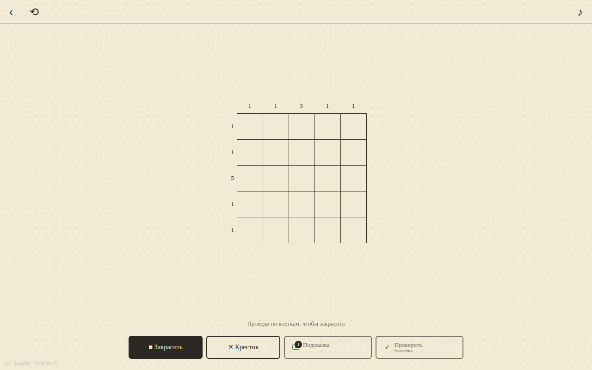

# Кот и японские кроссворды

Закрашивайте клетки по числам у строк и столбцов. Правильное решение открывает картинку.

[Играть в тестовую сборку](https://fanatat.github.io/games-dev/catnonogram/)

Здесь размещена статическая версия для запуска в браузере.
Тестовая сборка может отличаться от файлов этого репозитория.
[Карточка VK](https://vk.com/app54676906) · [Веб-версия](https://catnonogram-vk.vercel.app)

**Статус на 28 сентября 2026, подтверждён владельцем:** игра опубликована
в VK. В Яндекс Играх и CrazyGames пока не опубликована.



*Локальный запуск файлов этого репозитория, 28 сентября 2026.*

## Что это

Классический японский кроссворд: по числам у строк и столбцов закрашиваешь клетки и получаешь картинку. Кампания — 130 уровней от 5×5 до 15×15, сгруппированных в 13 тематических глав («Альбом»). Отдельно — ежедневный пазл с календарём: пул из 122 рисованных силуэтов 10×10 и 12×12, один и тот же на день у всех игроков.
Есть подсказки за рекламу, «лестница» наград за 7 дней входов, косметические темы оформления, звук на WebAudio без аудиофайлов. Интерфейс на русском и английском; прогресс хранится в облаке VK (VKWebAppStorage).

## Стек

- vanilla JS, без сборщика (номер сборки штампуется в `build.js`)
- DOM-рендер поля (сетка `div`), Canvas — для анимации готовой картинки
- VK Bridge 3.0.2 (`vk-bridge.min.js`, локально, без CDN)
- Модули `save.js`, `retention.js`, `ladder.js` — чистые функции без DOM, рассчитаны на прогон в Node

## Запуск локально

```bash
git clone https://github.com/Fanatat/catnonogram-vk.git
cd catnonogram-vk
python3 -m http.server 8000 --bind 127.0.0.1
```

Открыть `http://localhost:8000`. Вне VK игра стартует в dev-режиме (без рекламы и облачного сохранения).

## Моя роль

Игра собрана командой ИИ-агентов (Claude Code) под руководством автора: постановка задачи, приёмка живым запуском и тестами, релиз — автор; код — агенты.

SDK площадок обеспечивают авторизацию, рекламу, покупки и облачные сохранения
в соответствующем окружении. Локальный HTTP-сервер не воспроизводит эти интеграции.

## Состав репозитория

`levels.js` — кампания; `daily_levels.js` — ежедневные задания;
`nonogram.js` — правила; `save.js` — сохранения. Набор тестов уровней
в эту копию не входит. Здесь используется синтез Web Audio; в тестовой
сборке `games-dev` звуковые ресурсы могут быть другими.
